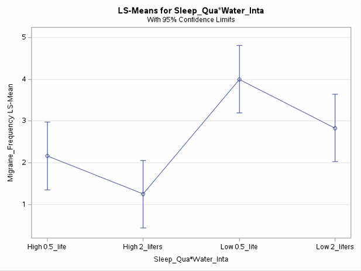
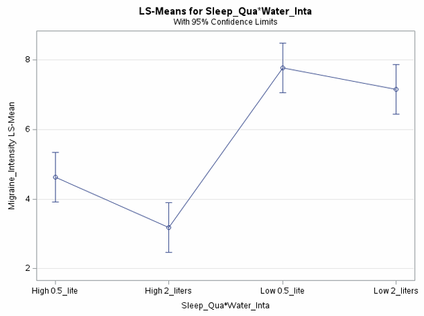

# SleepHydrationMigraineEffects


## Statistical investigation of non-pharmacological factors influencing migraines using a 2×2 factorial design.

<p align="center">
  
</p>

<p align="center">
  
</p>

## 📋 Overview

This research examines how sleep quality and water intake independently and interactively affect migraine frequency and intensity. Using a rigorous experimental design and statistical analysis, we demonstrate significant effects of both factors on migraine symptoms, providing evidence-based support for lifestyle interventions in migraine management.

## 🔍 Key Findings

<table>
  <tr>
    <td></td>
    <td>
      <ul>
        <li>High sleep quality significantly reduced migraine frequency (p<0.001)</li>
        <li>Adequate water intake (2L) resulted in fewer and less severe migraines (p<0.01)</li>
        <li>Effects were additive rather than interactive</li>
        <li>Participants with both high sleep quality and adequate hydration showed the lowest migraine frequency and intensity</li>
      </ul>
    </td>
  </tr>
</table>

## 🧪 Experimental Design

The study employed a **2×2 repeated measures factorial design**:

| | Adequate Water (2L) | Inadequate Water (0.5L) |
|---|---|---|
| **High Sleep Quality** | Condition 1 | Condition 2 |
| **Low Sleep Quality** | Condition 3 | Condition 4 |

- **Participants**: 12 individuals with history of migraines
- **Duration**: 4 weeks of monitoring
- **Controls**: Latin square design to control for order effects
- **Measurements**: Daily recording of migraine frequency and intensity (0-10 scale)

## 📊 Statistical Analysis

```sas
/* Repeated Measures ANOVA for Migraine Frequency */
proc mixed data=migraine;
 class Participant_ID Sleep_Quality_Group Water_Intake;
 model Migraine_Frequency = Sleep_Quality_Group Water_Intake 
 Sleep_Quality_Group*Water_Intake / ddfm=kr;
 random Participant_ID;
 lsmeans Sleep_Quality_Group*Water_Intake / diff adjust=tukey;
 title "Repeated Measures Analysis for Migraine Frequency";
run;
```

Our analysis pipeline included:
- Descriptive statistics & data visualization
- Normality testing for all conditions
- Repeated measures ANOVA
- Within-subject correlation analysis
- Effect size calculations
- Post-hoc comparisons with Tukey adjustments

## 📁 Repository Structure

```
SleepHydrationMigraineEffects/
├── code/
│   └── Final_project.sas           # Complete SAS analysis code
├── results/
│   ├── descriptive_stats.pdf       # Summary statistics
│   ├── box_plots.pdf               # Distribution visualizations
│   ├── anova_results.pdf           # Statistical test results
│   └── interaction_plots.pdf       # Visualized interactions
├── docs/
│   └── full_report.pdf             # Comprehensive research report
└── README.md                       # This file
```

## 🚀 Getting Started

### Prerequisites
- SAS software (9.4 or higher recommended)
- Basic knowledge of statistical analysis

### Running the Analysis
1. Clone this repository: `git clone https://github.com/lidajalili/SleepHydrationMigraineEffects.git`
2. Open `Final_project.sas` in SAS
3. Run the full script or individual procedures as needed
4. Results will be generated in the output window and can be exported

## 🔬 Methodology

The study was conducted in two phases:

**Pre-study Phase**:
- Participant screening and selection
- Baseline measurements 
- Training on data recording methods

**Experimental Phase**:
- 4-week monitoring period
- Daily assessment of sleep quality
- Controlled water intake
- Evening recording of migraine symptoms
- Weekly compliance check-ins

## 📚 References

1. McCaffery, M., Beebe, A., et al. (1989). Pain: Clinical manual for nursing practice, Mosby St. Louis, MO.
2. Khorsha, F., Mirzababaei, A., Togha, M., & Mirzaei, K. Association of drinking water and migraine headache severity. Journal of Clinical Neuroscience.
3. Song, T.J., Cho, S.J., Kim, W.J., Yang, K.I., Yun, C.H., & Chu, M.K. Poor sleep quality in migraine and probable migraine: a population study. The journal of headache and pain.

## 👥 Contributors

- Lida Jalili Dehkharghani ([@lidajalili](https://github.com/lidajalili))
- Minjuan Meng
- Gabriel Mendy

## 🧑‍🏫 Advisor

Dr. Gengsheng Qin, Georgia State University

## 🔗 Additional Resources

- [Statistical Analysis System (SAS) Documentation](https://documentation.sas.com/)
- [Migraine Research Foundation](https://migraineresearchfoundation.org/)
- [American Headache Society](https://americanheadachesociety.org/)

---

